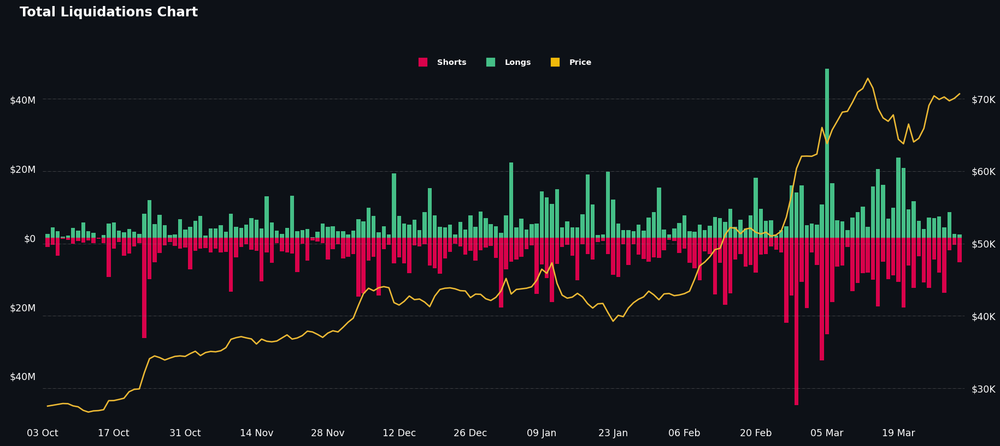

# Total Liquidation Chart 📊

This is a simple Python script that generates a liquidation chart for Bitcoin using the style of [Coinglass](https://www.coinglass.com/LiquidationData). The total liquidation chart provides an overview of the short and long liquidations as well as the corresponding BTC price on that day. The settings can be adjusted to also use other cryptocurrencies listed on Binance. The resulting plot can be used as an indicator to determine when to buy or sell Bitcoin. The chart is generated using the matplotlib library in Python.

<p align="center">
  
  
  <a href="https://github.com/psf/black"></a>
</p>

---

## Introduction

I have previously recreated this chart for my [fintwit-bot](https://github.com/StephanAkkerman/fintwit-bot), unfortunately coinglass removed their API so I had to recreate it using other sources. I used the chart found on [Coinglass](https://www.coinglass.com/LiquidationData) as a reference. The data is fetched using [Binance Public Data](https://github.com/binance/binance-public-data/) and new data is added which each run.

## Installation ⚙️

The required packages to run this code can be found in the requirements.txt file. To run this file, execute the following code block after cloning the repository:

```bash
pip install -r requirements.txt
```

## Usage ⌨️

To generate the chart, simply run the script using the following command:

```bash
python src/main.py
```

## Example 📊

The following chart is an example of the output generated by the script. The chart shows the total liquidations for Bitcoin over the past 180 days.


### References 📚

The following image was used as a reference to create the liquidation chart.


## Other Projects 📦

This project is part of a series of projects that I have created. You can find the other projects in the following list:

- [Bitcoin Rainbow Chart](https://github.com/StephanAkkerman/bitcoin-rainbow-chart)
- [Live Binance Charts](https://github.com/StephanAkkerman/live-binance-charts)
